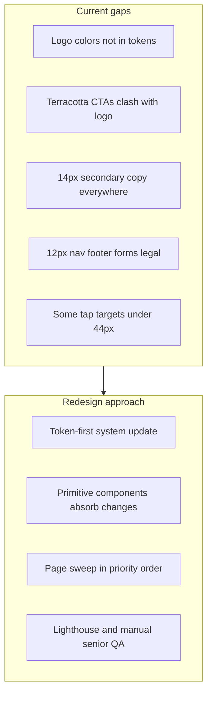

# Eminent Hospice — Senior-Friendly Brand Redesign Plan

> **Overview:** A phased redesign of the active `eminent-astro` site that aligns the visual system with the logo's blue/green/gold palette, raises typography and touch targets for older adult readers, and preserves the polished editorial hospice aesthetic — all driven from centralized design tokens rather than one-off page fixes.

**Status:** Planned (not yet implemented)  
**Created:** 2026-06-23

---

## Context and scope

**Active codebase:** [`eminent-astro/`](eminent-astro/) (Astro 6 + Tailwind v4, deployed to Cloudflare Pages). The Next.js app in [`EminentHospiceWebsite/`](../EminentHospiceWebsite/) is a frozen reference only — do not implement there.

**Audience reality:** Hospice sites serve patients, families, and caregivers — disproportionately **adults 55+** with varying vision, motor control, and digital confidence. The site must feel calm and premium (per [`REDESIGN_PLAN.md`](../EminentHospiceWebsite/REDESIGN_PLAN.md)) while being **easier to read and tap** than a typical marketing site.

**Two problems to solve together:**

1. **Brand mismatch** — Logo is vibrant sky blue + grass green + gold yellow (organic, hand-painted). Site uses muted navy `#2C5F8A`, terracotta `#B08458` (not in logo), and underused sage. Header shows a text wordmark, not the graphic logo.
2. **Typography gap** — Body is already 18px (good), but **~100+ usages** of `text-sm` (14px) and `text-xs` (12px) across nav, forms, footer, and content pages. Eyebrows (12px) and marginalia (13px) are below senior-friendly norms for any text that carries meaning.



---

## Design principles (locked for this redesign)

| Principle | What it means in practice |
|-----------|---------------------------|
| **Readable first** | No essential text below 16px. Decorative labels may go to 14px only if contrast is strong and content is duplicated nearby in larger type. |
| **One clear action per zone** | Phone and Referral stay visually dominant. Secondary links don't compete. |
| **Logo-led color** | Blue = trust/primary actions. Green = care/section accents. Gold = conversion (referral, phone). Terracotta demoted or removed. |
| **Polished, not clinical** | Keep Fraunces headings, cream surfaces, editorial spacing — increase size and contrast, not simplify to a generic government template. |
| **Organized hierarchy** | Bigger type with **more whitespace**, not denser blocks. Section rhythm, hairline rules, and clear heading steps prevent "wall of text" feeling. |
| **Touch-safe everywhere** | 44×44px minimum on all interactive elements (already claimed in [`README.md`](README.md) and accessibility statement — currently violated in places). |
| **Cognitive simplicity** | No hover-only menus. Plain-language intros. FAQ/accordion patterns (already good in [`Accordion.astro`](src/components/ui/Accordion.astro)) become the default for dense content. |

---

## Phase 1 — Design system foundation (tokens)

**Single source of truth:** [`src/styles/global.css`](src/styles/global.css) `@theme` block + utility classes (`.eyebrow`, `.lead`, `.marginalia`).

### 1A. Color system — logo-aligned palette

Replace the current role mapping with a three-accent system sampled from the logo (softened ~15% for WCAG on cream backgrounds):

| Token role | Current | Proposed base (500) | Usage |
|------------|---------|---------------------|-------|
| `primary` | `#2C5F8A` navy | `#2E8BC0` cerulean | Buttons, links, focus rings, footer shell (tinted), final CTA band |
| `accent-sage` | `#4A7C59` forest | `#5AAF3C` grass green | Badges, icon circles, alternating section accents, value cards |
| `accent-gold` *(new)* | — | `#E8B82E` | Referral CTA, phone highlights, section numerals (replaces terracotta) |
| `accent-warm` | `#B08458` terracotta | **Deprecate** | Map remaining usages to `accent-gold` or remove; keep token aliases temporarily to avoid breakage during migration |
| `ink` | `#1F2A37` | Keep, verify **7:1** on cream where possible | Body text — consider `#1A2430` for AAA on `surface-paper` |
| `surface-paper` | `#FBF8F3` | `#FAFAF8` (cool ivory, slight blue-green undertone) | Page background — subtle shift toward logo cool tones |
| `surface-ink` | `#1A2B3C` | Tint toward `primary-900` | Utility bar — reads as "brand dark" not generic charcoal |

Generate full 50–900 scales for `primary`, `accent-sage`, and `accent-gold` in `@theme`. Update shadow tints to use new primary hue.

**Contrast checks required before locking:**

- `primary-600` on white (buttons)
- `accent-gold-600` on white (referral button — may need dark text `#1A2430` instead of white if gold is too light)
- `ink-700` on `surface-paper` (target ≥7:1 for senior-friendly AAA where feasible)
- Footer `primary-100` links on `primary-900`

### 1B. Typography scale — senior-readable type system

Add explicit `--text-*` tokens to `@theme` (port missing display sizes from [`EminentHospiceWebsite/tailwind.config.ts`](../EminentHospiceWebsite/tailwind.config.ts)):

| Level | Current | Proposed | Notes |
|-------|---------|----------|-------|
| `body` | 18px / lh 1.65 | **18px / lh 1.7** | Keep; slight line-height bump |
| `body-sm` *(new semantic)* | 14px (`text-sm`) | **16px / lh 1.65** | Replace most `text-sm` for readable secondary copy |
| `body-xs` *(restricted)* | 12px (`text-xs`) | **14px min** | Legal/metadata only; never for instructions |
| `.lead` | 22px | **24px / lh 1.65** | Hero intros, section openers |
| `.eyebrow` | 12px + 0.18em tracking | **14px + 0.12em tracking** | Section labels — uppercase stays but less microscopic |
| `.marginalia` | 13px | **15px / lh 1.5** | Captions, stat labels — drop extreme `tracking-[0.14em]` on Hero |
| `h1` (hero) | `text-5xl`–`7xl` | Keep or +1 step on mobile | Large display helps low vision |
| Long-form prose | 17px in `LongFormLayout` | **18px / lh 1.75** | Match body; h2 `clamp` floor raised to 1.5rem → 1.75rem |
| FAQ answers | 14px | **16px** | Match accordion body in [`Accordion.astro`](src/components/ui/Accordion.astro) |
| Form labels/inputs | 14px | **16px** | Critical for older users filling forms |

**Organization strategy:** Define Tailwind utilities `text-body-sm`, `text-caption`, etc. in `@theme`, then sweep components. Avoid editing 100+ raw `text-sm` strings blindly — update primitives first so changes cascade.

### 1C. Spacing and layout rhythm

Bigger type needs more air to stay polished:

- Raise `--spacing-section-y` from `5rem` → `5.5rem` and `--spacing-section-2xl` from `6.5rem` → `7rem` in `@theme`
- Increase gap between stacked content blocks in [`SectionContainer.astro`](src/components/ui/SectionContainer.astro) by one step (`gap-10` → `gap-12` on desktop)
- Keep `max-w-prose` at **65ch** (already correct per WCAG readability guidance)
- Add `scroll-margin-top` on all heading anchors (long-form pages) — verify in [`LongFormLayout.astro`](src/layouts/LongFormLayout.astro)

### 1D. Touch target standard

Enforce in primitives only:

| Component | Current issue | Fix |
|-----------|---------------|-----|
| [`Button.astro`](src/components/ui/Button.astro) | `sm` = 36px | Remove `sm` from user-facing pages; floor `md` at 44px, default CTAs to `lg` (48px) |
| [`Header.astro`](src/components/layout/Header.astro) | Desktop nav ~32px tall; locale pill 32px | All nav links `min-h-11 py-3`; utility locale pill `min-h-11` |
| [`Footer.astro`](src/components/layout/Footer.astro) | Legal links 12px, short hit areas | `min-h-11` link class on all footer anchors |
| [`PageSidebar.astro`](src/components/layout/PageSidebar.astro) | TOC `py-1 text-sm` | `py-3 text-body-sm` (16px) |
| Form inputs | 44px height but 14px text | 44px height + **16px text** |

---

## Phase 2 — Brand identity integration

### 2A. Logo asset pipeline

1. Source: `/Users/seonho_kim/Downloads/Eminent_Hospice_Logo_no_back_ground-.svg` (1.5 MB — Bootstrap export artifact)
2. Run SVGO to produce `public/images/logo.svg` (<50 KB target)
3. Export `public/images/logo.png` at 2× for JSON-LD
4. Align [`site-config.ts`](src/data/site-config.ts) `BRAND.logo` to one canonical path
5. Generate favicon + `apple-touch-icon` from logo mark (replace placeholder [`favicon.svg`](public/favicon.svg))
6. Regenerate [`og-default.png`](public/og-default.png) using new palette (also fixes LAUNCH_CHECKLIST #2)

### 2B. Header redesign

[`Header.astro`](src/components/layout/Header.astro) changes:

```
[Utility bar: primary-900 bg | phone 16px | 24/7 label 14px | locale pill 44px]
[Main nav: logo image + optional shortened wordmark | nav links 16px | Referral gold CTA]
```

- Replace text-only wordmark with `` — graphic logo carries brand colors on every page
- If vertical space is tight on mobile, show logo mark only (crop to icon portion) + hide tagline
- Swap `accent-warm-500` referral button → `accent-gold-500` (verify contrast; use `ink-900` text on gold if needed)
- Fix Resources dropdown (LAUNCH_CHECKLIST #8): click/tap to toggle (already partially wired in script), correct `aria-expanded`, add `aria-controls` — **required for iPad users and older adults who don't hover**

### 2C. Footer redesign

[`Footer.astro`](src/components/layout/Footer.astro):

- Keep `bg-primary-900` but retint to new primary scale
- Replace `accent-warm-200` flourish → `accent-gold-300` or `accent-sage-300`
- Raise all link text to 16px; legal row to 14px minimum (not 12px)
- Hours and address: 16px, not `text-xs`

---

## Phase 3 — UI primitives (cascade layer)

Update these components first — they propagate to most pages:

| File | Changes |
|------|---------|
| [`Button.astro`](src/components/ui/Button.astro) | New `gold` variant; default sizes up; CTA shadow uses new primary hue |
| [`Badge.astro`](src/components/ui/Badge.astro) | Add `gold` variant; bump base to 14px; Hero badge: `sage` or `gold` dot, not warm |
| [`Accordion.astro`](src/components/ui/Accordion.astro) | Summary `text-xl` (20px); body `text-body-sm` (16px); chevron `h-5 w-5` |
| [`Stat.astro`](src/components/ui/Stat.astro) | Label: drop `.marginalia` → new `.stat-label` at 15–16px |
| [`EditorialFigure.astro`](src/components/ui/EditorialFigure.astro) | Caption 15px, reduce uppercase tracking |
| [`Marginalia.astro`](src/components/ui/Marginalia.astro) | Inherits updated `.marginalia` token |
| [`ContactForm.astro`](src/components/forms/ContactForm.astro) | Labels/inputs 16px; hints/errors 14px; required asterisk → `accent-gold-600` |
| [`ReferralCallbackForm.astro`](src/components/forms/ReferralCallbackForm.astro) | Same as contact |
| [`LongFormLayout.astro`](src/layouts/LongFormLayout.astro) | Prose 18px; port `text-display-lg`/`xl` tokens; sidebar TOC larger |

**Extract planned `CtaBand.astro`** (referenced in ASTRO_REBUILD_PLAN but never built) — shared bottom-of-page CTA using new gold/primary variants, replaces inline duplicated CTA blocks on understanding-hospice and similar pages.

---

## Phase 4 — Home page (pilot surface)

Apply token + primitive changes, then tune section-specific color accents:

| Section | File | Redesign notes |
|---------|------|----------------|
| Hero | [`Hero.astro`](src/components/home/Hero.astro) | Badge → sage; lead 24px; CTAs default `lg`; caption 15px not marginalia-micro |
| ByTheNumbers | [`ByTheNumbers.astro`](src/components/home/ByTheNumbers.astro) | Stat labels 16px; ensure numerals don't shrink on mobile |
| Philosophy | [`PhilosophyBand.astro`](src/components/home/PhilosophyBand.astro) | Eyebrow 14px; body paragraphs use `.lead` for first para |
| LevelsOfCare | [`LevelsOfCare.astro`](src/components/home/LevelsOfCare.astro) | Row numbers `accent-gold-500` not warm; title `text-2xl`; desc 18px prose |
| TeamCallout | [`TeamCallout.astro`](src/components/home/TeamCallout.astro) | Ampersand flourish → `accent-sage-400` |
| WhoWeServe | [`WhoWeServe.astro`](src/components/home/WhoWeServe.astro) | Numerals gold; card body 16px+ |
| Testimonial | [`Testimonial.astro`](src/components/home/Testimonial.astro) | Quote body stays large; attribution 16px |
| FinalCta | [`FinalCta.astro`](src/components/home/FinalCta.astro) | `bg-primary-700`; eyebrow `accent-gold-200`; phone card stays high-contrast white |

**Visual QA after home:** Screenshot at 375px, 768px, 1280px; verify no text truncation from larger sizes; Korean locale (`ko`) line-break check with `word-break: keep-all`.

---

## Phase 5 — Inner pages (priority order)

28 localized pages. Roll out in reading-complexity order:

**Tier 1 — High-traffic, high-stakes (do first)**

- [`contact.astro`](src/pages/en/contact.astro) / ko — contact card labels currently `text-xs uppercase` → 14px sentence case
- [`referral.astro`](src/pages/en/referral.astro) / ko — phone-first layout, largest type on site
- [`faq.astro`](src/pages/en/faq.astro) / ko — answers to 16px; consider Accordion for all Q&A
- [`for-families.astro`](src/pages/en/for-families.astro) / ko — dense `text-sm` lists → 16px + more `gap` between items
- [`services.astro`](src/pages/en/services.astro) / ko — service cards, footnotes

**Tier 2 — Educational long-form**

- [`understanding-hospice.astro`](src/pages/en/understanding-hospice.astro) / ko — myth/fact pills at 12px → 14px badges; condition cards 16px
- [`insurance.astro`](src/pages/en/insurance.astro) / ko — worst offender for `text-xs` footnotes; table text 16px; rate notes 14px min
- [`hospice-laws.astro`](src/pages/en/hospice-laws.astro) / ko
- [`grief-support.astro`](src/pages/en/grief-support.astro) / ko

**Tier 3 — Trust and legal**

- [`about.astro`](src/pages/en/about.astro) / ko — team role desc 12px → 15px; expand sage/gold value cards
- [`privacy.astro`](src/pages/en/privacy.astro), [`hipaa-notice.astro`](src/pages/en/hipaa-notice.astro), [`terms.astro`](src/pages/en/terms.astro), [`accessibility.astro`](src/pages/en/accessibility.astro) — legal can stay slightly smaller (14px) but not 12px; update accessibility statement to document new typography policy

**Tier 4 — Remaining**

- [`404.astro`](src/pages/404.astro)
- Careers page (planned in ASTRO_REBUILD_PLAN, not yet built — implement with new system from day one)

---

## Phase 6 — Content and cognitive accessibility

Typography alone is not enough for older adults. Content pass (EN + KO in [`en.json`](src/i18n/en.json) / [`ko.json`](src/i18n/ko.json)):

- **Plain-language intros** on insurance, hospice-laws, understanding-hospice: 2–3 sentence summaries at top in `.lead` before dense content
- **Phone number repetition** — every long page gets a visible "Call us" strip (reuse `CtaBand`) so users don't scroll back to header
- **Reduce uppercase** — contact card `dt` labels: switch from `UPPERCASE text-xs` to sentence case 14px (uppercase is harder to read for dyslexia and low vision)
- **Korean typography** — at 16–18px body, verify Noto Sans KR weight 400 is legible; avoid going below 16px for Hangul entirely

**Optional enhancement (Phase 6b):** Text-size toggle in utility bar (`A / A+ / A++` scaling `html { font-size }` to 100% / 112.5% / 125%). Not required for launch but high value for seniors; store preference in `localStorage`. Low implementation cost, high accessibility ROI.

---

## Phase 7 — Fix known blockers alongside redesign

Bundle these from [`LAUNCH_CHECKLIST.md`](LAUNCH_CHECKLIST.md) into the same release:

| # | Item | Why it matters for redesign |
|---|------|----------------------------|
| 2 | OG image | Regenerate with new palette during logo work |
| 4 | `{retentionDays}` token | Privacy page credibility |
| 5 | Email inconsistency | Contact flow for older users calling/emailing |
| 6 | About JSON-LD head slot | SEO (add `<slot name="head" />` to BaseLayout) |
| 7 | FAQ structured data | SEO |
| 8 | Resources dropdown a11y | Senior/iPad users |
| 9 | Turnstile vs honeypot copy | Trust |

---

## Phase 8 — QA and acceptance criteria

### Automated

- Lighthouse on Home, Services, FAQ, Contact, Insurance: **A11y ≥ 95**, Perf ≥ 90
- axe-core scan: zero critical violations
- Contrast audit on all button/background pairs in new palette (use `@axe-core/cli` or manual spot-check)

### Manual senior-UX checklist

- [ ] **200% browser zoom** — no horizontal scroll, no clipped CTAs
- [ ] **Read without squinting** — no essential content below 16px at 100% zoom
- [ ] **Tap with thumb** — all links/buttons ≥ 44px on iPhone and iPad landscape
- [ ] **Resources menu** — opens on tap, closes on Escape, correct `aria-expanded`
- [ ] **Forms** — complete contact + referral with 16px labels; error messages visible at 14px+
- [ ] **Phone links** — `tel:` works from FinalCta, header, mobile drawer, referral page
- [ ] **KO locale** — full home + one long-form page; no overflow from larger Hangul glyphs
- [ ] **Reduced motion** — `prefers-reduced-motion: reduce` disables scroll/reveal animations
- [ ] **Brand coherence** — logo in header matches button/badge colors; no terracotta remaining on conversion paths

### Documentation updates

- Update accessibility statement in `en.json` / `ko.json` with explicit senior-reader commitments (16px secondary minimum, 18px body, 44px targets)
- Add `SENIOR_UX.md` to `eminent-astro/` documenting typography policy for future contributors

---

## Implementation sequence (recommended)

```mermaid
gantt
  title Redesign implementation order
  dateFormat X
  axisFormat %s
  section Foundation
    Color and type tokens     :a1, 0, 1
    Logo SVG and favicon      :a2, 0, 1
    section Primitives
    Button Badge Accordion    :b1, 1, 2
    Forms and LongFormLayout  :b2, 1, 2
    section Shell
    Header and Footer         :c1, 2, 3
    section Pages
    Home page sections        :d1, 3, 4
    Tier 1 inner pages        :d2, 4, 5
    Tier 2 and 3 pages        :d3, 5, 7
    section Ship
    QA and launch fixes       :e1, 7, 8
```



**Estimated effort:** 3–5 focused days for tokens + shell + home + Tier 1; 2–3 additional days for remaining pages and QA.

---

## What we are NOT changing

- **Stack** — stay on Astro static; no Next.js work
- **Typography families** — Fraunces / Newsreader / Inter / Noto KR stay; they already read premium
- **Editorial layout philosophy** — asymmetric grids, marginalia, pull quotes remain; they get bigger, not removed
- **Bilingual routing** — `/en` / `/ko` structure unchanged
- **Form backend** — Formspree/Turnstile wiring is separate from visual redesign (but forms get larger type)
- **Dark mode** — out of scope (cream/light is correct for this audience)
- **Real photography** — placeholder images stay until client delivers; color grade brief should note "natural warmth, avoid heavy brown grading" to complement new blue-green palette

---

## Success definition

The redesign is complete when:

1. A first-time visitor **recognizes the same brand** from logo to buttons (blue / green / gold, no terracotta on CTAs)
2. A user 65+ can **read all navigation, form labels, and FAQ answers without zooming**
3. All interactive elements meet the **44px touch standard** the site already claims in its accessibility statement
4. The site still feels **editorial and polished** — not like a government accessibility retrofit
5. Lighthouse A11y ≥ 95 on the five key pages listed above

---

## Implementation checklist

- [ ] **tokens-colors** — Define logo-aligned primary/sage/gold scales in `global.css` `@theme`; deprecate accent-warm; retint surfaces and shadows
- [ ] **tokens-typography** — Add `--text-*` scale, bump `.eyebrow`/`.lead`/`.marginalia`, create `text-body-sm` (16px) utility; port display-lg/xl tokens
- [ ] **logo-assets** — SVGO logo SVG, update site-config, header img, favicon, apple-touch-icon, og-default.png with new palette
- [ ] **primitives** — Update Button, Badge, Accordion, Stat, forms, LongFormLayout; add gold variant and CtaBand component
- [ ] **shell** — Redesign Header (logo, 16px nav, gold referral, dropdown a11y) and Footer (16px links, gold accents)
- [ ] **home-page** — Apply color and typography pass to all 8 home section components
- [ ] **inner-pages-t1** — Sweep Tier 1 pages: contact, referral, faq, for-families, services (en + ko)
- [ ] **inner-pages-t2t3** — Sweep Tier 2–3 pages: understanding-hospice, insurance, hospice-laws, grief-support, about, legal pages
- [ ] **launch-fixes** — Bundle LAUNCH_CHECKLIST items 4–9 and JSON-LD head slot fix
- [ ] **qa-senior** — Run Lighthouse/axe, 200% zoom test, touch target audit, KO locale check; update accessibility statement
